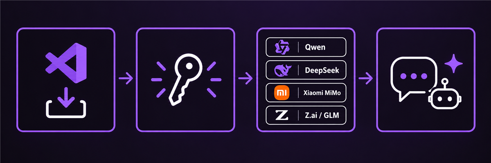

# NaN Builders for VS Code

[](https://github.com/svg153/nan-vscode/actions/workflows/ci.yml)
[](https://github.com/svg153/nan-vscode/actions/workflows/release.yml)
[](https://marketplace.visualstudio.com/items?itemName=svg153.nan-builders-vscode)

Use [NaN Builders](https://nan.builders/) models in VS Code Chat and Agent mode through the native `LanguageModelChatProvider` API.

> **Status:** early MVP and community-maintained. This extension is not an official NaN Builders product unless NaN Builders explicitly adopts or publishes it.



## What works

- Native `languageModelChatProviders` integration for VS Code Chat and Agent mode.
- API key stored in VS Code `SecretStorage`.
- API-key validation and model discovery through `GET https://api.nan.builders/v1/models`.
- The model picker follows the API-key-filtered list returned by NaN, so premium-only models appear only when the key can actually call them.
- Streaming chat through `POST https://api.nan.builders/v1/chat/completions`.
- VS Code tool definitions mapped to OpenAI-compatible function tools.
- Streamed tool calls mapped back to VS Code so supported models can run in Agent mode.
- Image inputs for catalogued vision-capable models.
- Opt-in inline ghost-text completions through the legacy `POST /v1/completions` endpoint when `nanBuilders.completionModel` is set ([issue #8](https://github.com/svg153/nan-vscode/issues/8)).
- Local status-bar usage when the API returns OpenAI-compatible streaming usage metadata.
- Account-wide monthly quota in the status bar via `GET /v1/usage` when an API key is configured, with local-session usage as fallback.
- Conservative handling of newly discovered model IDs that are not yet in the local metadata catalog.
- Remote-workspace support: the provider prefers the workspace extension host and falls back to the local UI host.

## Install

### From the Marketplace

Search for **NaN Builders for VS Code** in the Extensions view, or run:

```bash
code --install-extension svg153.nan-builders-vscode
```

The listing is community-maintained under the `svg153` publisher and is not an official NaN Builders product.

### From a release VSIX

1. Download the latest `.vsix` from [GitHub Releases](https://github.com/svg153/nan-vscode/releases).
2. In VS Code run **Extensions: Install from VSIX...**.
3. Reload the window if VS Code asks.

### From source

```bash
npm ci
npm run check
npm run package
```

Install the generated `nan-builders-vscode-*.vsix` with **Extensions: Install from VSIX...**. For interactive development, open the repository in VS Code and press `F5` to launch an Extension Development Host.

## Configure

1. Open the Command Palette.
2. Run **NaN Builders: Manage Provider**.
3. Choose **Set or replace API key** and paste a NaN API key.
4. Choose **Validate API key and refresh models**.
5. In Chat or Agent mode, select a model under the **NaN Builders** provider.

The model picker is intentionally limited to IDs returned by the key's `/v1/models` response. Run **NaN Builders: Refresh Models** after access changes. Provider extensions can also be found with the VS Code Marketplace filter:

```text
@tag:language-models
```

Available settings:

| Setting | Default | Purpose |
| --- | --- | --- |
| `nanBuilders.apiBaseUrl` | `https://api.nan.builders/v1` | OpenAI-compatible API base URL. Change only for development or trusted compatible servers. |
| `nanBuilders.modelCacheSeconds` | `300` | Model discovery cache duration. |
| `nanBuilders.showStatusBar` | `true` | Show usage in the status bar: account-wide monthly quota % when an API key is configured, otherwise local session usage. |
| `nanBuilders.includeUnknownModels` | `false` | Expose unknown IDs without tool or vision metadata. |
| `nanBuilders.completionModel` | `""` | Model ID for opt-in inline ghost-text completions; empty disables the feature and no completion request is sent. |

## Remote workspaces

The provider prefers the workspace extension host when using WSL, SSH, or a Dev Container. This keeps the model provider on the same host as the Chat/Agent session and avoids a known VS Code routing problem where Auto can replace an explicitly selected remote-provider model. In a remote workspace, install the extension and enter the API key in that remote host's SecretStorage.

For a local workspace, it continues to run locally. To force a published installation to the remote host while testing, use:

```json
"remote.extensionKind": {
  "svg153.nan-builders-vscode": ["workspace"]
}
```

## Agent mode and model metadata

NaN chat models with compatible function tool calling are marked as supporting tools and appear in Agent model selection. The extension maps VS Code tools to OpenAI-compatible function tools, handles streamed tool calls, and maps tool names back to the original VS Code tool names.

Only model IDs returned by `/v1/models` are exposed. Known non-chat endpoints are removed. Unknown IDs are hidden by default so an embedding, image, or audio endpoint is not accidentally advertised as a chat model. Set `nanBuilders.includeUnknownModels` to `true` to expose unknown IDs conservatively while local metadata catches up.

VS Code needs context-window, output-budget, image, and tool-calling metadata, while `/v1/models` is the authorization and discovery source. The extension therefore keeps a small local capability catalog and never exposes a catalogued model unless the API key can access it. Refresh the catalog when NaN changes model capabilities.

## Usage and limitations

With an API key configured, the status bar shows the account-wide monthly quota for the most restricted model you have actually used this month (`$(graph) NaN NN%`), read from `GET /v1/usage`. **NaN Builders: Show Usage** shows per-model monthly usage for the current month with a refresh button, the local session history, provider management, and the NaN dashboard. Without an API key, the status bar and command fall back to local session usage.

Account-wide usage details:

- Requests are authenticated with the stored API key, never browser cookies or `nan-cli` sessions.
- The window is the current calendar month (UTC), clamped client-side to the API's maximum of 90 days, with at most 500 rows per page and up to 3 pages merged.
- Percentage labels come only from published monthly token caps (for example deepseek-v4-flash 3B, mimo 1B, glm5.3-flash 2B, qwen3.8-flash 500M). Models without a published monthly counter (qwen3.6, gemma4) show **No token counter**; glm5.3 shows its published caps but never a fabricated percentage.
- The headline percentage is the most restricted monthly quota in use, never a sum across models.
- `api_requests` counts are only meaningful from 2026-09-02, the API's data cutoff.
- Usage refreshes are throttled client-side (60s between automatic refreshes, plus a 30 requests/minute limiter). A 429 response surfaces its `Retry-After` hint.
- Errors never clear the last good snapshot; they are reported in the tooltip and command output.

Local usage remains available regardless of the API: **NaN Builders: Show Usage** also shows per-model daily aggregates (UTC days) retained locally for 30 days (up to 1,000 model/day records); use **Clear local history** in that dialog to remove them. Only counts and model IDs are stored in VS Code extension storage—never prompts, completions, API keys, or request payloads.

VS Code does not expose a documented usage-reporting callback for third-party chat providers, so local counts only cover turns where the API returned OpenAI-compatible streaming usage metadata; see [issue #7](https://github.com/svg153/nan-vscode/issues/7).

Inline ghost-text completions are opt-in and off by default. Set `nanBuilders.completionModel` to a model ID returned by `/v1/models` and the extension registers an `InlineCompletionItemProvider` for file-scheme documents. Each suggestion is one `POST {apiBaseUrl}/completions` request carrying only the last 4,000 characters before the cursor, capped at 64 completion tokens and 1,000 suggestion characters, and aborted as soon as you keep typing; HTTP errors, network failures, and empty or malformed responses never surface stale text. Quality depends on the chosen model, and while enabled each pause while typing can send an extra billed request that local usage history does not count yet (see [issue #7](https://github.com/svg153/nan-vscode/issues/7)).

## Architecture

```text
VS Code Chat / Agent
        |
        v
LanguageModelChatProvider
        |
        +--> GET  /v1/models
        |
        +--> GET  /v1/usage
        |
        +--> POST /v1/chat/completions
                 |  SSE text
                 |  tool calls
                 +  usage
```

No alternate chat webview is created; the provider uses the built-in VS Code Chat and Agent UX.

## Troubleshooting

- **No models appear:** validate the key, then refresh models. Check that the key can call `/v1/models`.
- **A model is missing:** the API key does not currently return that model, or it is a known non-chat endpoint.
- **A request stops without text:** NaN may have hit a reasoning-only truncation; try a shorter prompt or a model with adjustable reasoning.
- **Remote or WSL window:** the provider prefers the workspace extension host; install the extension and configure the key in that remote host's SecretStorage.
- **Key safety:** use **Clear API key** from the management command to remove it from SecretStorage.

## Security

- API keys are stored with VS Code `SecretStorage`, not in settings JSON or the repository.
- The extension does not log API keys.
- Changing `nanBuilders.apiBaseUrl` sends the configured key to that endpoint, so only change it to a server you trust.

## Development and contribution

```bash
npm ci
npm run check       # compile, unit tests, isolated VS Code Insiders test
npm run package     # create a VSIX
```

Commits and pull-request titles use [Conventional Commits](https://www.conventionalcommits.org/). See [`CONTRIBUTING.md`](https://github.com/svg153/nan-vscode/blob/main/CONTRIBUTING.md) for the GSD issue workflow, skills, validation checklist, pull-request expectations, and release process.

Project policy and research live in [`docs/`](https://github.com/svg153/nan-vscode/tree/main/docs):

- [Repository policy](https://github.com/svg153/nan-vscode/blob/main/docs/REPOSITORY.md)
- [Validation checklist](https://github.com/svg153/nan-vscode/blob/main/docs/VALIDATION.md)
- [Provider research](https://github.com/svg153/nan-vscode/blob/main/docs/PROVIDER-RESEARCH.md)
- [Implementation decisions](https://github.com/svg153/nan-vscode/blob/main/docs/DECISIONS.md)
- [Contribution guide](https://github.com/svg153/nan-vscode/blob/main/CONTRIBUTING.md)
- [Release history](https://github.com/svg153/nan-vscode/blob/main/CHANGELOG.md)

## Reference projects

The provider architecture was checked against existing open-source integrations rather than copied wholesale:

- [`huggingface/huggingface-vscode-chat`](https://github.com/huggingface/huggingface-vscode-chat)
- [`JohnnyZ93/oai-compatible-copilot`](https://github.com/JohnnyZ93/oai-compatible-copilot)

`helmcode/nan-cli` is useful as an endpoint and behavior reference. Its code is not copied because no license file was found in its repository root during the initial review.

## Roadmap

1. Evaluate native NaN MCP registration after the core provider is stable.
2. Move capability metadata to server-provided metadata when NaN exposes it.
3. Publish to the VS Code Marketplace only after naming, branding, publisher ownership, and support expectations are agreed with NaN Builders.

## License

MIT. See [`LICENSE`](LICENSE).
